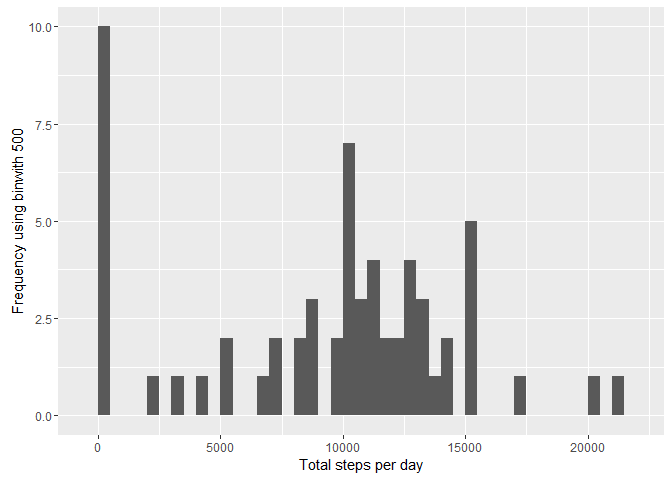
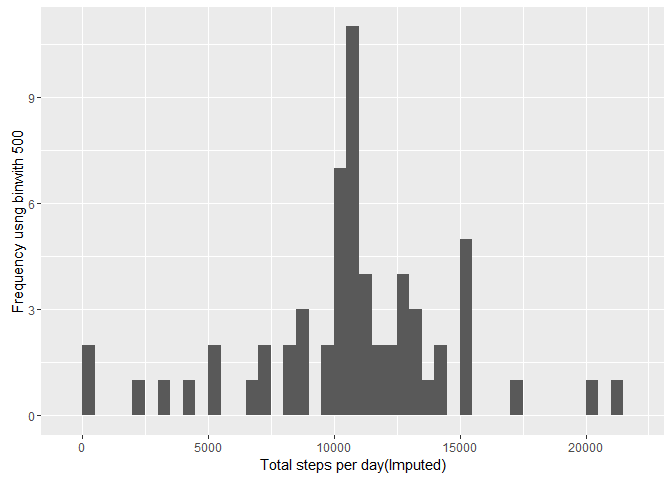

# ReproducableResearch-Assignment1
knyzam  
December 20, 2015  

This is an R Markdown document. Markdown is a simple formatting syntax for authoring HTML, PDF, and MS Word documents. For more details on using R Markdown see <http://rmarkdown.rstudio.com>.

When you click the **Knit** button a document will be generated that includes both content as well as the output of any embedded R code chunks within the document. You can embed an R code chunk like this:

##Loading and preprocessing the data


```r
library(Hmisc)
```

```
## Loading required package: lattice
## Loading required package: survival
## Loading required package: Formula
## Loading required package: ggplot2
## 
## Attaching package: 'Hmisc'
## 
## The following objects are masked from 'package:base':
## 
##     format.pval, round.POSIXt, trunc.POSIXt, units
```

```r
library(ggplot2)
library(scales)
```

### 1. Load the data & process/transform the data (if necessary) into a format suitable for your analysis


```r
if(!file.exists ('activity.csv')){
    unzip ('activity.zip')
}
activityData <- read.csv ('activity.csv')
```


## What is mean total number of steps taken per day?


```r
stepsPerDay <- tapply (activityData$steps, activityData$date, sum, na.rm= TRUE)
```

### 1. Make a histogram - total number of steps taken per day

```r
qplot (stepsPerDay, xlab= 'Total steps per day', ylab= 'Frequency using binwith 500', binwidth= 500)
```

 

### 2. Calculate and report the mean and median total number of steps taken per day

```r
stepsPerDayMean <- mean (stepsPerDay)
stepsPerDayMedian <- median (stepsPerDay)
```

* Mean: 9354.2295082
* Median:  10395


## What is the average daily activity pattern?

```r
averageStepsPerTimeBlock <- aggregate (x= list (meanSteps= activityData$steps), by= list (interval= activityData$interval), FUN= mean, na.rm= TRUE)
```

### 1. Make a time series plot

```r
ggplot(data= averageStepsPerTimeBlock, aes (x= interval, y= meanSteps)) +
    geom_line() +
    xlab ("5-minute interval") +
    ylab ("Average number of steps taken") 
```

 

### 2. Which 5-minute interval, on average across all the days in the dataset, contains the maximum number of steps?


```r
mostSteps <- which.max (averageStepsPerTimeBlock$meanSteps)
timeMostSteps <-  gsub ("([0-9]{1,2})([0-9]{2})", "\\1:\\2", averageStepsPerTimeBlock[mostSteps,'interval'])
```

* Most steps at: 8:35

## Imputing missing values

### 1. Calculate and report the total number of missing values in the dataset 


```r
numMissingValues <- length (which(is.na(activityData$steps)))
```

* No. of missing values: 2304

### 2 & 3. Devise a strategy for filling in all of the missing values in the dataset & create a new dataset that is equal to the original dataset but with the missing data filled in.


```r
activityDataImputed <- activityData
activityDataImputed$steps <- impute (activityData$steps, fun= mean)
```

### 4. Make a histogram of the total number of steps taken each day and Calculate and report the mean and median total number of steps taken per day. 

```r
stepsPerDayImputed <- tapply (activityDataImputed$steps, activityDataImputed$date, sum)

qplot(stepsPerDayImputed, xlab= 'Total steps per day(Imputed)', ylab= 'Frequency usng binwith 500', binwidth= 500)
```

 


```r
stepsPerDayMeanImputed <- mean (stepsPerDayImputed)
stepsPerDayMedianImputed <- median (stepsPerDayImputed)
```

* Mean (Imputed): 1.0766189\times 10^{4}
* Median (Imputed):  1.0766189\times 10^{4}


## Are there differences in activity patterns between weekdays and weekends?

### 1. Create a new factor variable in the dataset with two levels - "weekday" and "weekend" indicating whether a given date is a weekday or weekend day.


```r
activityDataImputed$dateType <-  ifelse (as.POSIXlt(activityDataImputed$date)$wday %in% c(0,6), 'weekend', 'weekday')
```

### 2. Make a panel plot containing a time series plot

```r
averagedActivityDataImputed <- aggregate(steps ~ interval + dateType, data= activityDataImputed, mean)
ggplot (averagedActivityDataImputed, aes(interval, steps)) + 
    geom_line() + 
    facet_grid(dateType ~ .) +
    xlab("5-minute interval") + 
    ylab("avarage number of steps")
```

 
